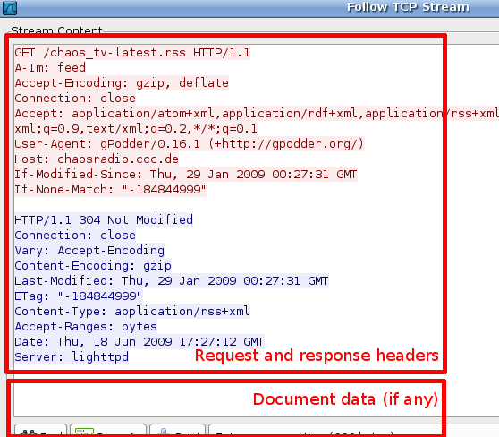

This guide gives a short overview on how to send the HTTP conversation for downloads that fail due to timeouts. Please be sure to review all information that you submit, as it might contain confidential data that you don't want exposed (like passwords, etc..).

How to capture
--------------

You have to have root access to capture the network traffic on your network card. Furthermore, you need to have **tcpdump** installed on the devices where you run gPodder. If you run gPodder on your Desktop computer, you should be able to directly use Wireshark to capture data. If you are running gPodder on a headless system or on a Maemo device, using tcpdump, copying the capture file and opening it with Wireshark is probably the better option.

The command to capture network traffic is described at [this page](http://www.wireshark.org/docs/wsug_html_chunked/AppToolstcpdump.html):

` tcpdump -i `<network interface>` -s 1500 -w `<filename>

(If you are using a normal user account, become root first or use sudo)

If you are using a **Nokia N800** or **Nokia N810** device, download and install tcpdump from [tcpdump on Maemo Garage](https://garage.maemo.org/projects/tcpdump/) and then use the following command:

    cd /home/user
    sudo gainroot
    tcpdump -i wlan0 -s 1500 -w gpodder_capture.dump

(reproduce the bug.. after you're done, press Ctrl+C)

    chown user:users gpodder_capture.dump
    mv gpodder_capture.dump MyDocs
    exit

This should leave you with a **gpodder\_capture.dump** file that you find in the File manager directly in your tablet's folder. Use Bluetooth, ssh/scp or some other method to get that file on your Desktop computer.

Opening the dump in Wireshark
-----------------------------

After you have got the dump file on your Desktop computer, install [Wireshark](http://www.wireshark.org) on it. Click on File -&gt; Open and select the dump file (that is **gpodder\_capture.dump** if you have been following the instructions above). In the "Filter" entry box below the toolbar enter the expression

` http.user_agent contains "gPodder"`

and hit enter. This should leave you with one or more HTTP GET requests in the packet list. Pick the one that is the buggy download, right-click on it and select **Follow TCP stream**. This will open a window that shows the HTTP conversation between gPodder and the server. Click on **Save as** and select a nice name. Open the resulting file in a text editor and trim all the data that is not necessary (there are normally two plaintext blocks that are the request and response headers; after that the data follows; the data is mostly not needed, the headers are the interesting part).

The following screenshot illustrates how the request and response headers look like:

Reporting the bug
-----------------

With your new, stylish HTTP headers saved in a text file, please go to https://github.com/gpodder/gpodder/issues and file a new bug report. Attach the text file that you just created. This should hopefully help us track down any bugs related to downloads. Again, be sure to remove any confidential information that you don't want to publish, especially HTTP authentication data.
