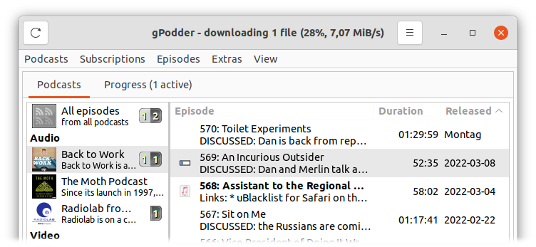

gPodder is a simple, open source [podcast](https://en.wikipedia.org/wiki/Podcast) client.

In development since 2005 with a proven, mature codebase.


Latest version: {{version}},
released {{site.data.gpodder.date}}.
([release notes](https://github.com/gpodder/gpodder/releases))

### Downloads

-   Windows: [gPodder {{site.data.windows.version}} installer][win], [portable app][win-portable]
-   macOS: [gPodder {{site.data.macos.version}}][mac]
-   Linux/BSD: [Flatpak][flatpak], [distributions][repology] or [run from Git](docs/run-from-git.md)
-   Others: [Sailfish OS][sailfish], [Ubuntu PPA][ppa], [Source code][source]

### Support

- Read the [documentation](docs/)
- Ask on the [mailing list](http://www.freelists.org/list/gpodder)
- Report problems at the [issue tracker](https://github.com/gpodder/gpodder/issues)

### Visit our website

Check out more details on our [official website](http://127.0.0.1:8080).

[win]: https://github.com/gpodder/gpodder/releases/download/{{site.data.windows.version}}/windows-gpodder-{{site.data.windows.version}}-installer.exe
[win-portable]: https://github.com/gpodder/gpodder/releases/download/{{site.data.windows.version}}/windows-gpodder-{{site.data.windows.version}}-portable.exe
[mac]: https://github.com/gpodder/gpodder/releases/download/{{site.data.macos.version}}/macOS-gPodder-{{site.data.macos.version}}.zip
[ppa]: https://launchpad.net/~gpodder/+archive/ubuntu/ppa
[flatpak]: https://flathub.org/apps/details/org.gpodder.gpodder
[source]: https://github.com/gpodder/gpodder
[repology]: https://repology.org/project/gpodder/versions
[sailfish]: https://openrepos.net/content/keeperofthekeys/gpodder

